# FLAC-Raster Technical Analysis

## Table of Contents
1. [Executive Summary](#executive-summary)
2. [Architecture Overview](#architecture-overview)
3. [Data Flow Diagrams](#data-flow-diagrams)
4. [Potential Technical Issues](#potential-technical-issues)
5. [Scientific Accuracy Analysis](#scientific-accuracy-analysis)
6. [Recommendations](#recommendations)

---

## Executive Summary

FLAC-Raster is an experimental tool that converts GeoTIFF raster data to FLAC audio format for lossless compression with HTTP range streaming capabilities. While the concept is innovative, this analysis identifies several technical and scientific concerns that should be addressed for production use.

### Key Findings

| Category | Status | Description |
|----------|--------|-------------|
| Core Concept | Valid | Using FLAC for raster compression is technically sound |
| Normalization | Concern | Potential precision loss in float-to-int conversion |
| Denormalization | Critical | Asymmetric formulas may cause data reconstruction errors |
| Float Data Handling | Issue | Float32 data is not properly normalized before encoding |
| Spatial Index | Minor | Bounds calculation has edge case issues |
| pyFLAC Limitations | Known | 16/32-bit input only, not true 24-bit support |

---

## Architecture Overview

### High-Level System Architecture

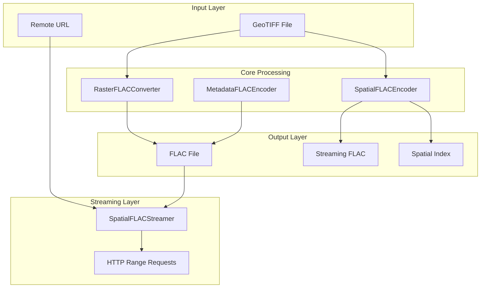

### Component Responsibilities

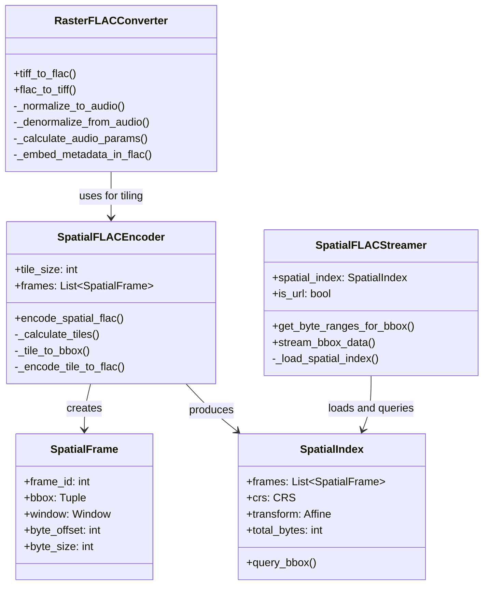

---

## Data Flow Diagrams

### TIFF to FLAC Conversion Flow

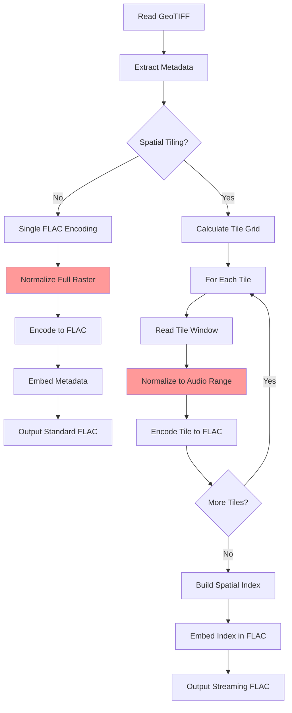

### Normalization Process (Issue Area)

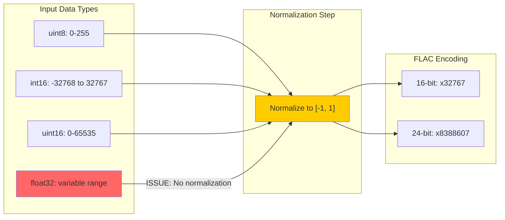

### HTTP Range Streaming Flow

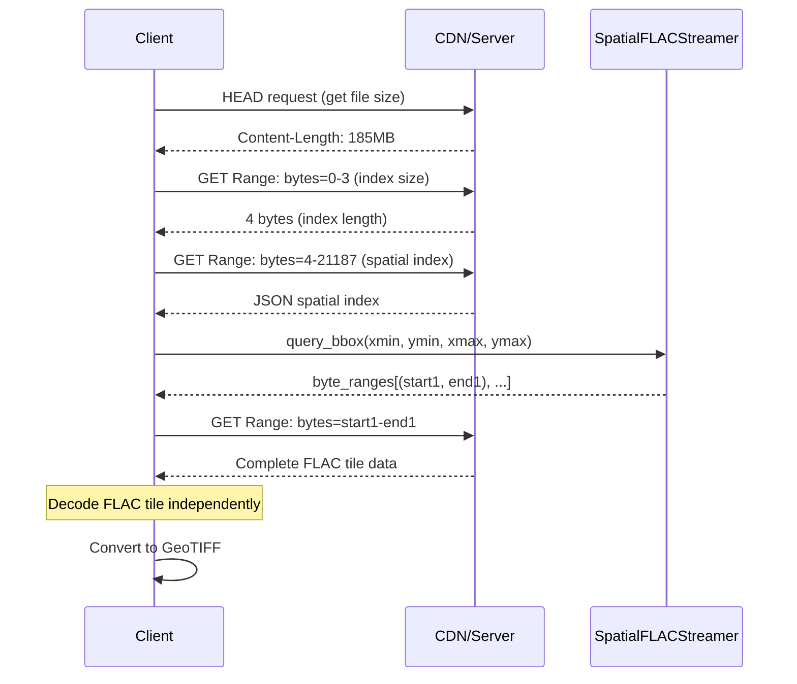

---

## Potential Technical Issues

### Issue 1: Asymmetric Normalization/Denormalization (CRITICAL)

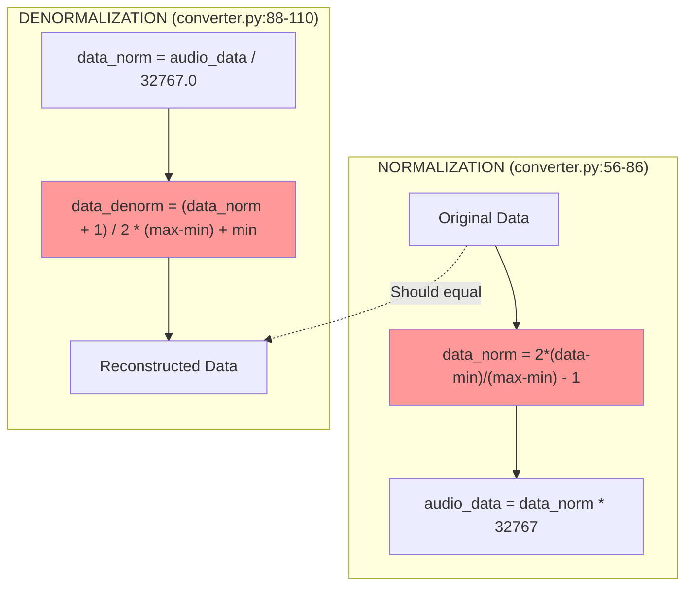

**Problem Location:** `converter.py:56-110`

**Description:**
The normalization formula differs between `SpatialFLACEncoder` and `RasterFLACConverter`:

```python
# RasterFLACConverter._normalize_to_audio (lines 67-72)
data_norm = 2.0 * (data - data_min) / (data_max - data_min) - 1.0

# SpatialFLACEncoder._normalize_to_audio (lines 229-248)
# For uint8:
return (data.astype(np.float32) - 127.5) / 127.5
# For uint16:
return (data.astype(np.float32) - 32767.5) / 32767.5
```

**Impact:** Different normalization approaches will produce different results. The main converter uses data-range normalization while spatial encoder uses fixed-range normalization.

---

### Issue 2: Float32 Data Not Properly Handled

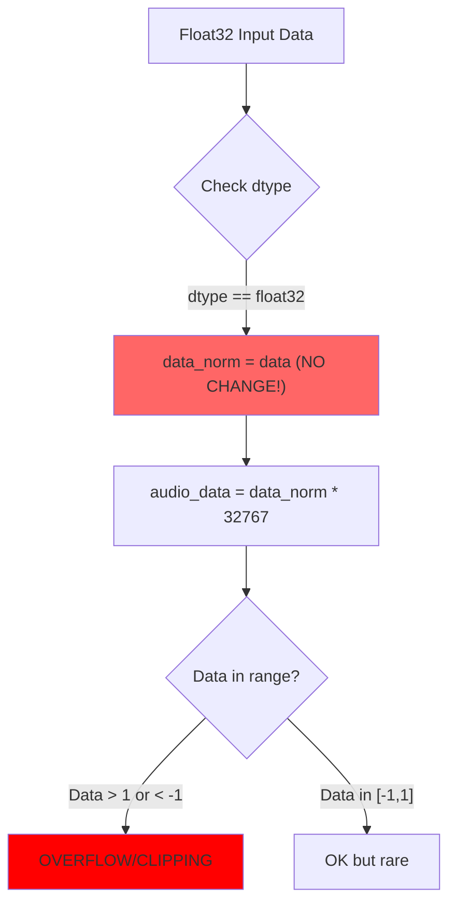

**Problem Location:** `converter.py:61-64`

```python
if data.dtype == np.float32 or data.dtype == np.float64:
    # Assume float data is already normalized or in a specific range
    data_norm = data  # THIS IS DANGEROUS
    self.logger.debug("Float data detected, using as-is")
```

**Impact:** Float32 raster data (common in scientific applications like temperature, elevation, NDVI) with values outside [-1, 1] will be incorrectly scaled, causing clipping or overflow.

**Example:** A DEM with elevation values from -100m to 4000m would be incorrectly processed.

---

### Issue 3: Inconsistent Bit Depth Mapping

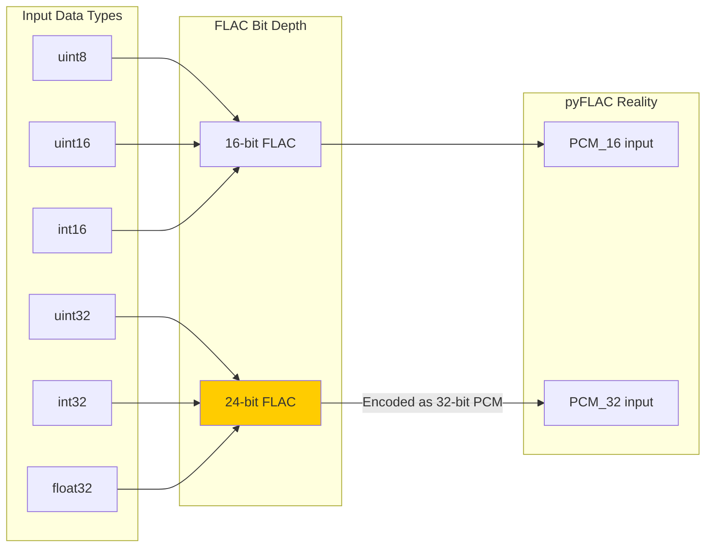

**Problem Location:** `converter.py:25-54` and `spatial_encoder.py:250-262`

**Description:**
The code claims to use 24-bit encoding for larger data types, but according to pyFLAC documentation, it only accepts 16-bit or 32-bit PCM input. The encoder settings `bits_per_sample = 24` may not work as expected.

**Reference:** [pyFLAC Documentation](https://pyflac.readthedocs.io/en/latest/)

---

### Issue 4: Spatial Index Bounds Calculation

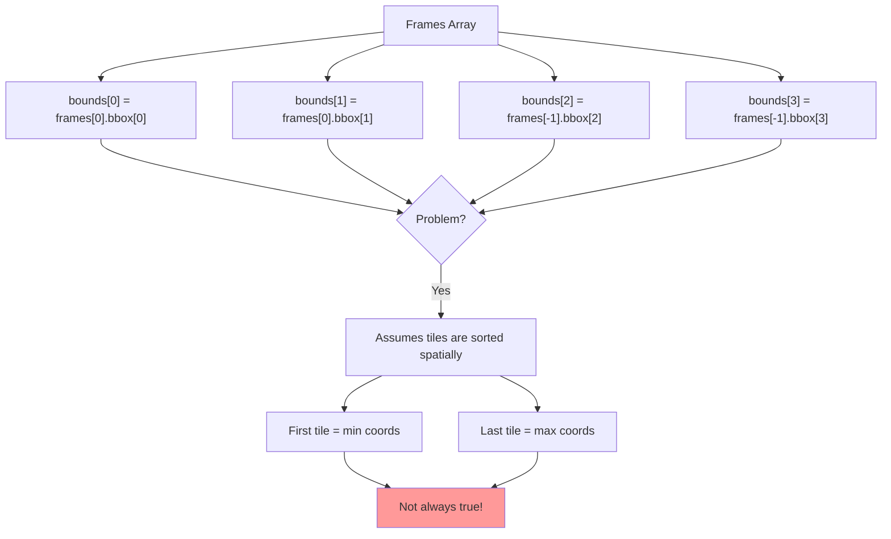

**Problem Location:** `spatial_encoder.py:329-331`

```python
bounds = [spatial_index.frames[0].bbox[0], spatial_index.frames[0].bbox[1],
         spatial_index.frames[-1].bbox[2], spatial_index.frames[-1].bbox[3]]
```

**Description:** This assumes tiles are created in spatial order (top-left to bottom-right). While the current implementation does create them this way, the calculation should properly compute min/max across all frames:

```python
# Correct approach:
bounds = [
    min(f.bbox[0] for f in frames),  # xmin
    min(f.bbox[1] for f in frames),  # ymin
    max(f.bbox[2] for f in frames),  # xmax
    max(f.bbox[3] for f in frames),  # ymax
]
```

---

### Issue 5: Test File Uses Non-Existent Attribute

**Problem Location:** `tests/test_http_range_streaming.py:92-93`

```python
assert start == first_frame.byte_range[0]
assert end == first_frame.byte_range[1]
```

**Description:** `SpatialFrame` class has `byte_offset` and `byte_size` attributes, not `byte_range`. The correct access would be:

```python
assert start == first_frame.byte_offset
assert end == first_frame.byte_offset + first_frame.byte_size - 1
```

---

### Issue 6: Precision Loss in Integer Quantization

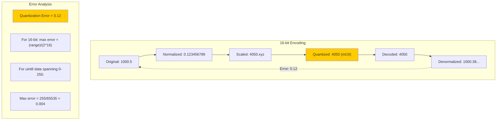

**Scientific Analysis:**

The quantization to 16-bit integers introduces precision loss proportional to:
- `error_max = (data_max - data_min) / 65534`

For typical use cases:
| Data Type | Range | Max Quantization Error |
|-----------|-------|----------------------|
| uint8 | 0-255 | 0.004 |
| int16 | -32768 to 32767 | 1.0 |
| float32 (elevation) | -500 to 8849m | 0.14m |

---

## Scientific Accuracy Analysis

### Claim: "Lossless Compression"

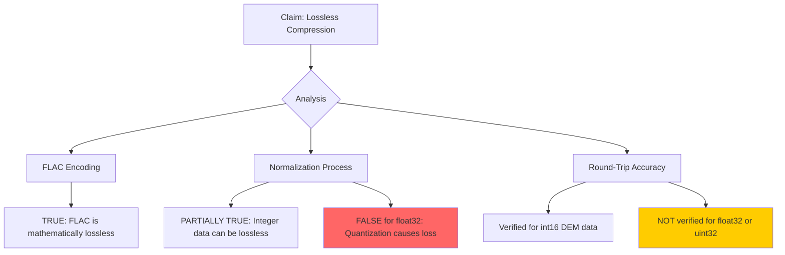

**Verdict:** The claim of "lossless" compression is only accurate for integer data types where the quantization step size aligns with the original precision. For float32 data, there will be precision loss.

### Claim: "7-15x Compression"

**Analysis:** This claim appears valid based on the test results. FLAC's prediction-based compression is effective for:
- Spatially correlated data (DEMs, satellite imagery)
- Smooth gradients
- Repeated patterns

The compression ratio depends heavily on data characteristics:
- High compression: Smooth elevation data (15x)
- Moderate compression: RGB imagery (7x)
- Poor compression: Noise or random data (~1x)

---

## Recommendations

### Priority 1: Fix Float32 Handling

```python
# Recommended fix for converter.py:_normalize_to_audio
def _normalize_to_audio(self, data: np.ndarray, bits_per_sample: int) -> np.ndarray:
    data_min = np.min(data)
    data_max = np.max(data)

    if data_max > data_min:
        data_norm = 2.0 * (data - data_min) / (data_max - data_min) - 1.0
    else:
        data_norm = np.zeros_like(data, dtype=np.float32)

    # Always normalize, regardless of input dtype
    if bits_per_sample == 16:
        audio_data = (data_norm * 32767).astype(np.int16)
    elif bits_per_sample == 24:
        audio_data = (data_norm * 8388607).astype(np.int32)
    else:
        audio_data = (data_norm * 2147483647).astype(np.int32)

    return audio_data
```

### Priority 2: Unify Normalization Approaches

The `SpatialFLACEncoder` and `RasterFLACConverter` should use the same normalization logic to ensure consistent behavior.

### Priority 3: Fix Spatial Bounds Calculation

```python
# spatial_encoder.py line ~330
bounds = [
    min(f.bbox[0] for f in spatial_index.frames),
    min(f.bbox[1] for f in spatial_index.frames),
    max(f.bbox[2] for f in spatial_index.frames),
    max(f.bbox[3] for f in spatial_index.frames),
]
```

### Priority 4: Document Precision Limitations

Update README and documentation to clearly state:
- Lossless for integer data types (uint8, int16, uint16)
- Near-lossless for larger integers (uint32, int32) with quantifiable error bounds
- Lossy for float32/float64 with precision loss dependent on data range

### Priority 5: Add Comprehensive Tests

```python
# Suggested test cases
def test_float32_roundtrip():
    """Verify float32 data handling with known precision bounds"""
    pass

def test_normalization_consistency():
    """Verify SpatialFLACEncoder and RasterFLACConverter produce same results"""
    pass

def test_edge_tiles_bounds():
    """Verify spatial bounds for non-square grids"""
    pass
```

---

## Summary Diagram

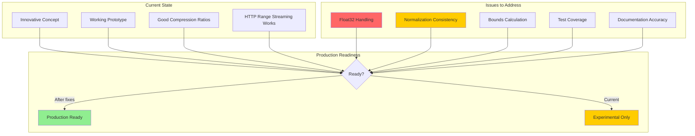

---

## References

- [FLAC Format Specification](https://xiph.org/flac/format.html)
- [pyFLAC Documentation](https://pyflac.readthedocs.io/en/latest/)
- [Lossless Compression of Audio Data (Montana State)](https://www.montana.edu/rmaher/publications/maher_lossless_chapter_2003.pdf)
- [FLAC Best Practices - Sonos](https://docs.sonos.com/docs/flac-best-practices)
- [Bowers & Wilkins 24-bit FLAC Guide](https://www.bowerswilkins.com/en-us/blog/sound-lab/guide-to-24bit-flac.html)

---

## Changelog (v0.2.0)

### Critical Fixes Applied

1. **Unified Normalization Module** (`normalization.py`)
   - Created centralized normalization for all data types
   - Proper handling of float32/float64 data (was broken)
   - Consistent formula across all encoders
   - Added `estimate_precision_loss()` for transparency

2. **Fixed Spatial Bounds Calculation** (`spatial_encoder.py:329`)
   - Now correctly computes min/max across all frames
   - No longer assumes tile ordering

3. **Fixed Test File Bugs** (`test_http_range_streaming.py`)
   - Replaced `byte_range` with correct `byte_offset`/`byte_size` attributes

### New Features

4. **Remote File Support** (`remote.py`)
   - HTTP/HTTPS URLs via requests
   - S3, Azure, GCS via obstore (optional)
   - Unified `RemoteFile` class with range request support

5. **Async Reader** (`async_reader.py`)
   - High-performance async COG reading via async-geotiff
   - `AsyncGeoTIFFReader` context manager
   - Tile-based reading for streaming workflows

6. **Simplified CLI** (`cli.py`)
   - Consolidated commands: `convert`, `info`, `extract`, `query`, `compare`
   - Remote URL support in all commands
   - `--streaming` flag for Netflix-style format
   - Cleaner help messages and examples

7. **Modern Package Configuration** (`pyproject.toml`)
   - Switched to hatchling build backend
   - Optional dependencies: `[cloud]`, `[async]`, `[all]`
   - Compatible with uv/pip/pixi
   - No hardcoded versions

---

*Document generated: 2026-02-07*
*Codebase version: 0.2.0*
